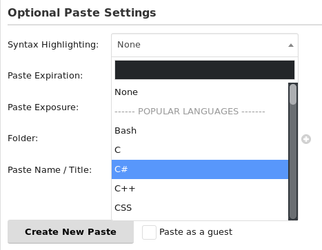
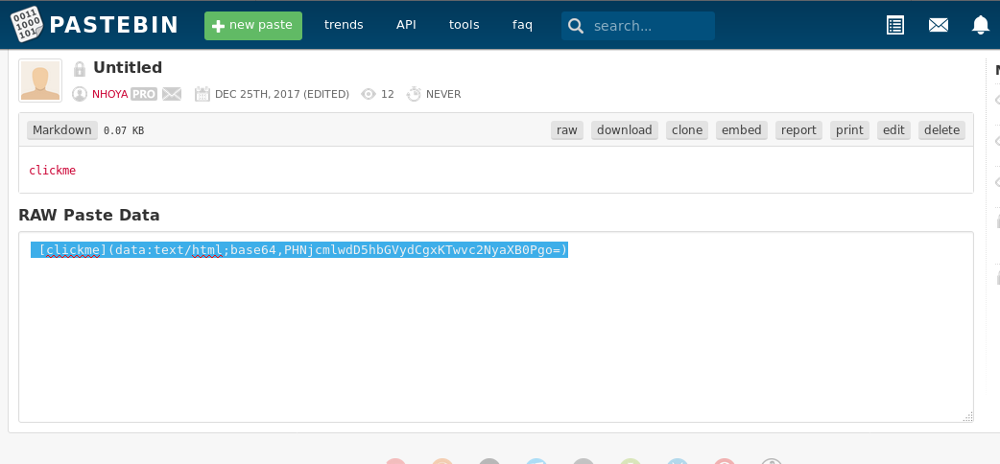
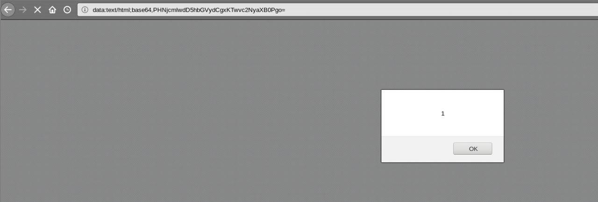
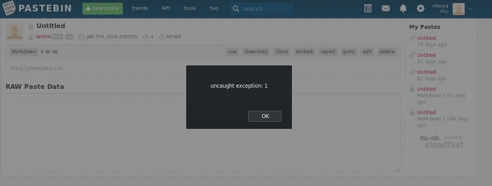

# pastebin.com Markdown XSS

pastebin.com XSS via unsanitized markdown output

We all love Markdown, right? It's a fast ad user-friendly way to beautify our documentation. Well, all that glitters is not gold, in this case not for system administrators.
Some time ago playing a CTF event with [my team](https://jbzteam.github.io) we solved an interesting challenge during [Hack.lu 2017](https://2017.hack.lu/ctf/) called Mitsune were a misconfigured instance of [mitsune](https://github.com/lepture/mistune) was given and we had to send a malicious link containing an XSS payload to an administrator to steal his cookies. You can find two writeup with different approaces [here](https://www.pwndiary.com/write-ups/hack-lu-ctf-2017-mistune-write-up-web150/) and [here](https://rawsec.ml/en/Hacklu-2017-write-up/#150-mistune-web)

After the CTF's end, me and my teammate Donato Onofri started to investigate more on how this kind of vulnerability affects worldwide markdown services and we end up with multiple reports ([here](https://github.com/leanote/leanote/issues/676), [here](https://github.com/adtac/commento/issues/154) and [here](https://github.com/leanote/leanote/issues/719)) But as you can see all of those are relatively small services.

## The pastebin case

During my investigation I found that even a *massive* service like pastebin was affected by this kind of vulnerability.

When we create a new paste we can select which language to use for the syntax highlight, in this list there is also a **Premium only** pick for Markdown parsing, let's try it.

First I tried to send a simple HTML body to see if it's interpreted but without success.

I also tried a simple payload using `[link]()` but apparently the script tag is not interpreted neither. Lastly I tried the old trick we used to solve the Mitsune challenge: we used a `base64` payload and the content-type base64 to let the javascript handle the decode and the execution. I crafted a new markdown link entity, containing the following payload:

`[clickme](data:text/html;base64,PHNjcmlwdD5hbGVydCgxKTwvc2NyaXB0Pgo=)`

and I generated a new paste, clicking on the new link I finally got an alert, confirming that my payload was working.

The cool part is that you need a premium account to generate the paste but you can spread it with anyone :)

## The second PoC

Some time after I found and reported the vulnerability I finally received an email from the pastebin administrators claiming that they patched it. 

I gave it a look and found that they blocked the `data` entity and my old PoC was no longer working.

To confirm definitively that the problem was solved I created another paste with a simpler payload

`[totallyharmlesslink](javascript:window.onerror=alert;throw%201)`

and, again, I got an alert :D

## Conclusion

Markdown XSS are real and tons of services are affected due to unsanitized output. If you mantain a project that is using a markdown parser I suggest you to read [this](https://github.com/showdownjs/showdown/wiki/Markdown%27s-XSS-Vulnerability-(and-how-to-mitigate-it)), if you are a pentester or a bug hunter I suggest you to starting consider this kind of vulnerability ([I even got a CVE :P](https://www.cvedetails.com/cve/CVE-2017-1000459/))

Fun fact: during an event I was talking about CTFs and someone said me: "I don't play CTFs because they are not real world scenarios" :)

## Timeline

- 22/12/17 Vulnerability found
- 23/12/17 Vulnerability reported
- 24/12/17 First contact with the administrators, they were kind enough to provide me with a premium lifetime account and the promise to patch ASAP
- 02/04/18 I sent a mail to the adminstrators to solicit the patch and ask information about the disclosure details
- 10/04/18 I received a mail saying that the vulnerability was patched
- 10/04/18 I sent a reply containing a new PoC with a bypass for the current patch
- 11/04/18 Patch for the second PoC released

## Interested in my works?

Follow me on twitter `@0x7a657461` and linked.in `0xzeta`

BTC Address: `346dDn4BjTodMkGkb5iTyoJ5Z2wi9g9QiM`
